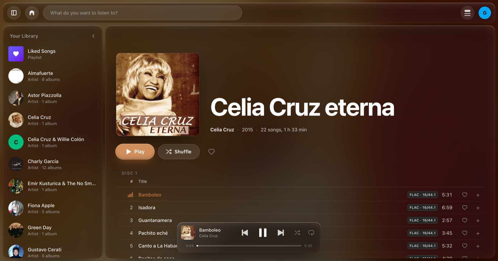
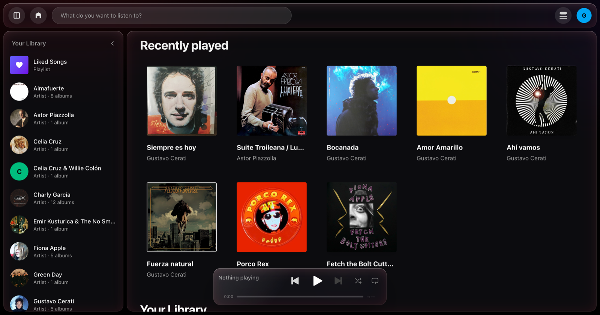
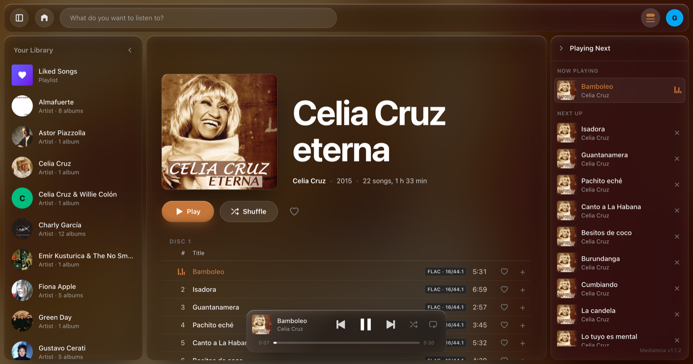
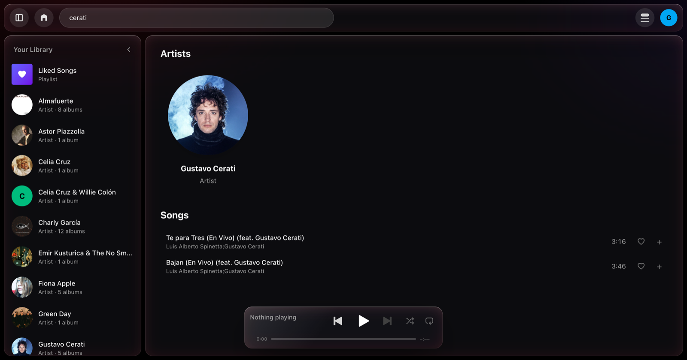
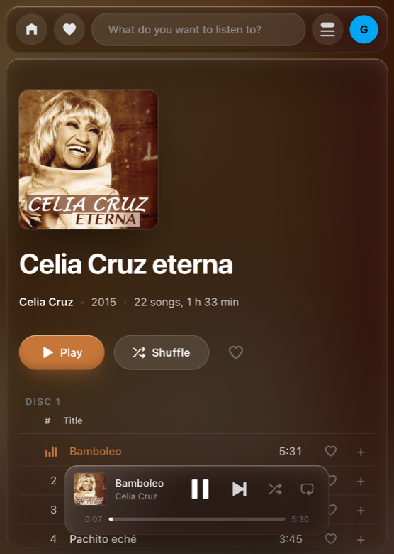

<h1 align="center">Mediateca</h1>

<p align="center">
  <b>A self-hosted music server for the records you already own.</b><br>
  It reads your FLACs where they sit, serves them untouched, and gets out of the way.
</p>

<p align="center">
  <a href="https://github.com/gstn-caruso/mediateca/actions/workflows/ci.yml"></a>
  <a href="LICENSE"></a>
  
  
</p>

<p align="center">
  
</p>

---

Mediateca runs on the machine your music is already on — a NAS, a mini PC, an old
laptop — and turns it into something that feels like Spotify, except every song
in it is one you own.

It **does music, and nothing else**. No films, no photos, no plugins, no library
that has to be curated before it works. You point it at a directory of FLACs; it
reads their tags, finds their covers, and that is the setup.

Nothing is transcoded, ever. The FLAC goes to the browser exactly as it is on
disk — bit for bit, 16/44.1 or 24/96 — because every modern browser plays it
natively and the bytes were already right.

**It expects to be on your LAN, and it has no passwords.** Whoever is listening
picks a name off a grid, the way Netflix asks. That is a deliberate trade, and
the reason not to put this on the open internet: anybody who can reach it can be
anybody. See [SECURITY.md](SECURITY.md).

## What it looks like

|  |  |
|---|---|
|  |  |
| **Your library.** Artists are round, records are square — you can tell a person from a sleeve with the words covered. | **The queue.** Reorder it by dragging. When it runs out, the rail offers the rest of the artist. |
|  |  |
| **Search** across artists, albums and songs — and a song says who sings it, so a guest credit finds it too. | **On a phone**, the whole thing, queue included. |

## Features

- **Plays what you have.** FLAC, served raw with `Range` support, so seeking in a
  34 MB file doesn't download 34 MB.
- **The disk is the truth.** Rename a file and the song is still the song: the
  scan pairs what vanished with what arrived, so your playlists and hearts
  survive it. A [beets](https://beets.io) database, if you keep one, is invited
  but not required.
- **Profiles.** Everyone in the house gets their own playlists, hearts and
  history.
- **Playlists, likes, play history**, and a "recently played" shelf that fills
  itself.
- **Hide an artist, or highlight one** — and it is yours, not the house's. A
  hidden artist leaves your library and is never offered again; they are not
  deleted, and searching the name by hand still finds them. A highlighted one
  gets the opposite: a couple of the "what's next" slots are theirs whatever
  else is playing, filled with the songs of theirs you actually go back to, and
  they come up heavier when the library is drawn from.
- **The music doesn't stop when you navigate.** The player lives outside the page
  Turbo replaces.
- **Your media keys work.** The OS is told what's playing, so the lock screen and
  Control Center drive it.
- **It installs.** Safari puts it in the Dock and Chrome installs it: a window of
  its own, its own icon, no address bar. Hand the deploy a certificate and it gets
  a service worker too — so a NAS that is rebooting says so in Mediateca's voice,
  instead of leaving you on the browser's error page. See
  [Installing it as an app](#installing-it-as-an-app).
- **It scans itself.** Every night at 4am, and on demand.
- **Artist portraits** it goes and finds — a photo you left beside the records
  first, then Deezer, then Wikimedia, then Spotify if you hand it credentials.

## Try it

You need Docker, and a directory with music in it.

```bash
git clone https://github.com/gstn-caruso/mediateca.git
cd mediateca

export MUSIC_DIR=/path/to/your/music
export SECRET_KEY_BASE=$(openssl rand -hex 64)

docker compose up --build
docker compose exec mediateca bin/rails music:import
```

Then open <http://localhost:8080> and pick a name.

The music is mounted **read-only**: Mediateca never writes to it, never moves it
and never transcodes it. The container runs as uid 1000, so that user has to be
able to read the files.

> Compose is the way *in*. To actually live with it, deploy it to the machine the
> music is on — see [below](#deploying-it).

### How the music has to be laid out

```
Music/
└── Almafuerte/
    └── 1995 - Mundo guanaco/
        ├── cover.jpg
        ├── 01 - Desencuentro.flac
        └── 02 - Dijo el droguero al drogador.flac
```

An album is the directory two levels below the root; its tracks are every FLAC
under it (including in a `CD01/`). The tags inside the files win over the folder
names — the folder is only what's used when a file says nothing. Any of
`cover.jpg`, `folder.jpg` or `front.jpg` is the sleeve, and anything with *back*
or *inlay* in the name is not.

## Configuration

Everything arrives from the environment.

| | | |
|---|---|---|
| `MEDIA_ROOT` | **The trust boundary.** No request can name a file outside it. | `/mnt/data/multimedia` |
| `MUSIC_ROOT` | Where the scan looks for music. | `$MEDIA_ROOT/Música` |
| `BEETS_DATABASE` | A beets library, read-only. Leave it empty and the disk decides alone. | `/mnt/data/beets/musiclibrary.db` |
| `SECRET_KEY_BASE` | Signs the session cookie. Required in production. | — |
| `SPOTIFY_CLIENT_ID` / `SPOTIFY_CLIENT_SECRET` | Optional. Only for artist portraits Wikimedia didn't have. | — |
| `LASTFM_API_KEY` / `LASTFM_API_SECRET` | Optional. Without them there is no Last.fm in the app at all. Get them from an [API account](https://www.last.fm/api/account/create). | — |
| `PORTRAITS_ROOT` | Where the portraits it fetches are kept. | `storage/portraits` |
| `FFPROBE` | The ffprobe binary the scan reads tags with. | `ffprobe` |
| `SOLID_QUEUE_IN_PUMA` | Run the nightly scan inside the web process. | — |
| `TLS_HOST` | Set by the deploy when there is a certificate in front. It tells Rails the page is HTTPS, so it stops writing `http://` URLs into it. | `mediateca.lan` |

## Deploying it

Mediateca deploys with [Kamal](https://kamal-deploy.org) to one machine over SSH.
The image is built **on the server** and pulled from a registry on the server, so
it never leaves the house: no registry token, no private image on anybody's
internet.

Where that machine is, who you are on it, and where the music sits are yours, not
the project's — so they are not in the repo:

```bash
cp .kamal/deploy.env.example .kamal/deploy.env   # the host, the user, the music
cp .kamal/secrets.example    .kamal/secrets      # the master key, looked up
```

Fill in `.kamal/deploy.env`, then:

```bash
bin/kamal setup      # the first time
bin/kamal deploy     # every time after
bin/kamal import     # scans the music into the catalog
bin/kamal logs
bin/kamal console
```

The scan also runs on its own, every night at 4am.

### Installing it as an app

Mediateca ships a manifest and an icon, so Safari's **File ▸ Add to Dock** works
over plain HTTP, as deployed: a window of its own, no address bar, its own icon
in the Dock, and the media keys still driving it.

Two things need more than that, because a browser hands them only to a page it
considers *secure* — and on a LAN that means HTTPS, `localhost` being the one
exception:

- **Chrome's Install.**
- **The service worker.** It is what answers when the server doesn't: a NAS coming
  back up, a cable out. Without it, an installed window with no address bar and no
  reload button just shows the browser's error page — which reads as though
  Mediateca is what broke.

There is no public name here for Let's Encrypt to prove, so the certificate is one
you issue yourself, from a small authority your own machines trust.
[mkcert](https://github.com/FiloSottile/mkcert) is three commands:

```bash
brew install mkcert                                                   # or your package manager
mkcert -install                                                       # trust your own CA
mkcert -cert-file .kamal/tls/cert.pem -key-file .kamal/tls/key.pem nas.local
```

The name has to be one your LAN already resolves — a NAS usually answers to
`something.local` over Bonjour, which is free, or you can add a record on the
router. Then name it in the deploy:

```bash
# .kamal/deploy.env
MEDIATECA_TLS_HOST=nas.local
```

`.kamal/tls/` is gitignored, and `.kamal/secrets` reads the two files from there.
It is a file and not a keychain for one reason: on this project the thing that
deploys is a CI runner living on the NAS, and it has to read the key with nobody
there to unlock anything. If yours deploys from the NAS too, the certificate goes
next to its other coordinates (`~/mediateca-ci/tls/`), and the workflow copies it
into the checkout.

Then deploy. From there on the app answers to that name over HTTPS and **stops
answering to a bare IP** — the name is the whole point of the certificate.

Two things follow from that, and they are the price:

- **Every machine that listens has to trust the CA**, not just the one that made
  it: `mkcert -install` there too, or copy the root out of `mkcert -CAROOT`. A
  machine that doesn't will call the page insecure, and you are back where you
  started — no install, no worker. On a phone or a tablet that means installing
  the root by hand.
- **The old `http://192.168.x.x` bookmarks stop working**, and an installed app
  is bound to its origin, so the one you install from the IP is a different app
  from the one you install from the name. Pick the name and stay on it.

### Preparing the server

Kamal can install Docker itself, but only as root over SSH, and most NAS boxes
deny that. So:

```bash
ssh you@server 'curl -fsSL https://get.docker.com | sudo sh'
ssh you@server 'sudo usermod -aG docker $USER'
```

Two things will bite you, and both have bitten us:

**`/var` is usually a small partition**, and that is where Docker's `data-root`
*and* containerd's live. Two images and a build cache fill it, and the app dies
with `SQLite3::FullException: database or disk is full`. Move **both** — since
Docker 23 the images live in containerd's content store, so moving only Docker's
is not enough:

```bash
sudo systemctl stop docker.socket docker containerd

sudo mkdir -p /srv/docker /srv/containerd
sudo rsync -aHAX --remove-source-files /var/lib/docker/     /srv/docker/
sudo rsync -aHAX --remove-source-files /var/lib/containerd/ /srv/containerd/
sudo rm -rf /var/lib/docker /var/lib/containerd

printf '{\n  "data-root": "/srv/docker"\n}\n' | sudo tee /etc/docker/daemon.json
sudo sed -i 's|^disabled_plugins = \["cri"\]|disabled_plugins = ["cri"]\n\nroot = "/srv/containerd"|' /etc/containerd/config.toml

sudo systemctl start containerd docker
```

**Something else may hold `:80`.** kamal-proxy needs it — on ours it was the
nginx that used to front Jellyfin:

```bash
ssh you@server 'sudo systemctl disable --now nginx'
```

## Development

```bash
bin/setup                # dependencies, database, assets
bin/dev                  # http://localhost:3000

bin/rails test           # unit, integration and contract tests
bin/rails test:system    # system tests, in headless Chrome
bin/ci                   # everything GitHub Actions runs
```

The tests never touch a real music library: the fixtures are a handful of real
FLACs holding thirty seconds of silence, and the whole suite runs without ffprobe
installed. The one test that does shell out to it is a
[contract test](test/contracts/ffprobe_contract_test.rb), which checks that
ffprobe still describes a FLAC the way the scanner assumes.

## How it works

The interesting parts — why the queue lives inside the `<audio>` element, how a
renamed file keeps its playlists, what `MediaFile` is guarding, why search is a
`LIKE` scan and not an index — are written down in
**[docs/ARCHITECTURE.md](docs/ARCHITECTURE.md)**.

## Not there yet

- **A page for liked albums.** An album can be hearted; only songs have a page
  listing them.
- **Dragging a song up a playlist.** The queue reorders by drag; a playlist still
  moves a song one place at a time. And the drag is mouse-only — HTML5
  drag-and-drop doesn't fire on touch.
- **A PIN on a profile**, for when a home LAN stops being the whole story.
- **Video.** There was a `Video::` tree here once, unreachable from any route, and
  it is gone: a plan is not code, and git remembers it. When it comes back it will
  be written against what is true then.

## Contributing

Yes, please — start with [CONTRIBUTING.md](CONTRIBUTING.md). The short of it:
every behavior change enters through a failing test, structural cleanups go in
their own commit, and the simplest thing that works wins.

## License

[AGPL-3.0-or-later](LICENSE). If you run a modified Mediateca as a service, the
people using it are entitled to your changes.
